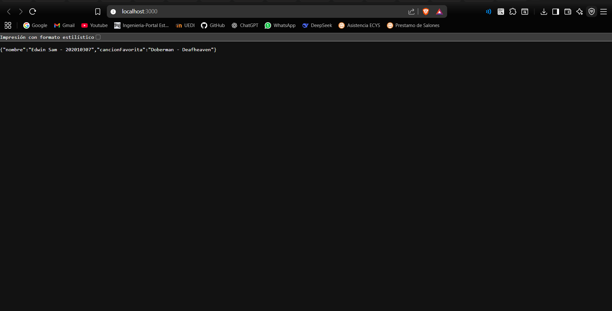
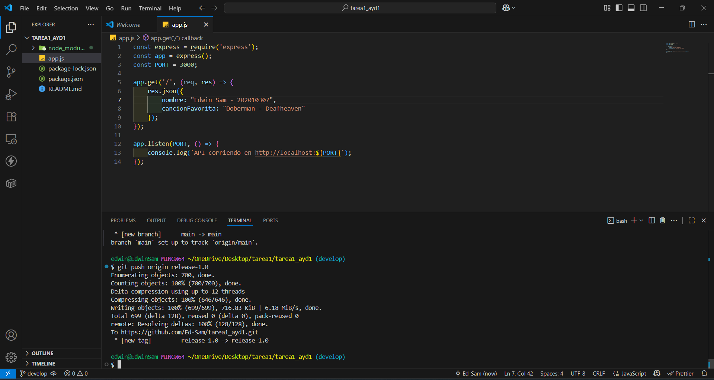
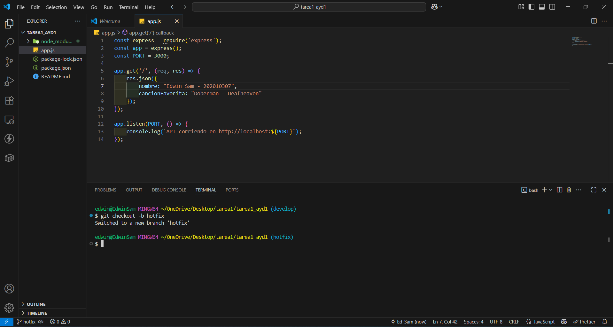
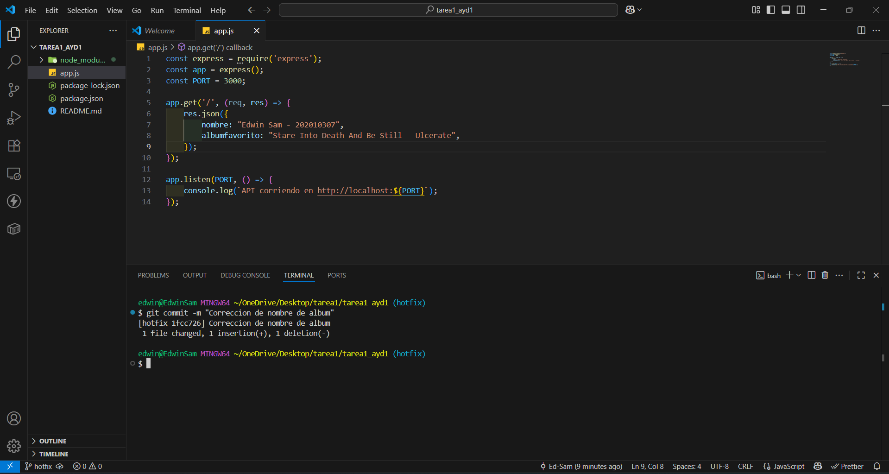
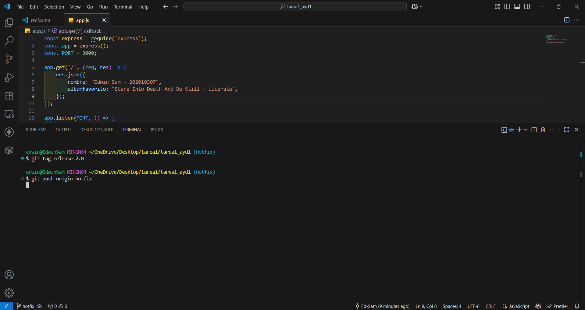
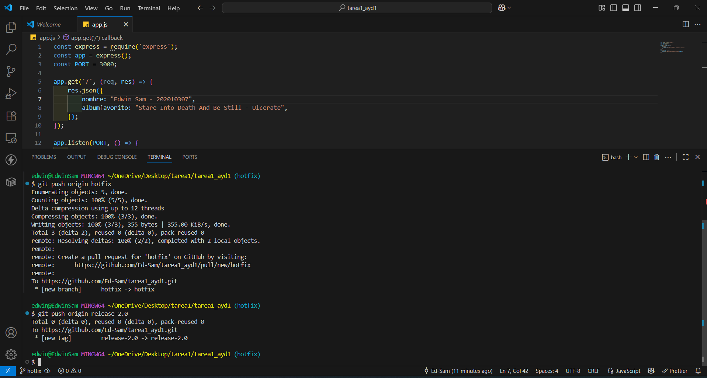
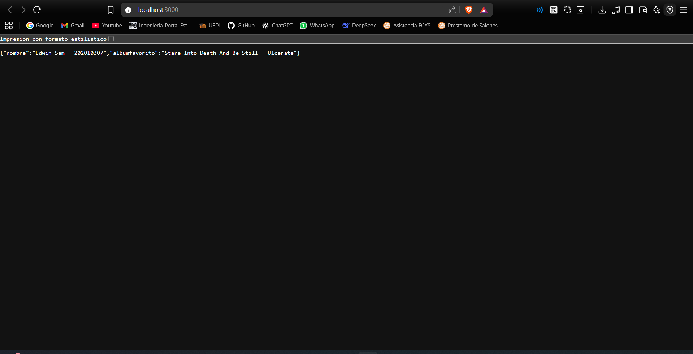
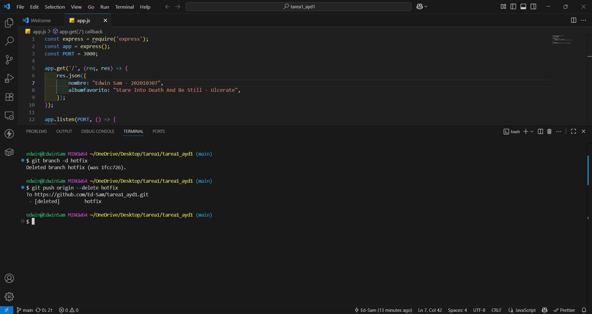

# Tarea #1 - Repositorios públicos y tags

## Edwin Aman Sam Pum - 202010307

## Capturas de pantalla

1. **API version 1.0 (cancion favorita)**
   

2. **Tag release-1.0**
   

3. **Creacion de Rama Hotfix**
   

   

4. **Tag release-2.0**
   
   

5. **API versión 2.0 (álbum favorito)**
   

6. **Eliminacion Rama Hotfix**
   

## Explicación

1. Se desarrollo una API REST basica con Express.js
2. Se creo el tag `release-1.0` para la versión inicial
3. Se creo la rama `hotfix` para modificar la API
4. Se creo el tag `release-2.0` para la versión corregida
5. Se elimino la rama `hotfix` despues de fusionar los cambios