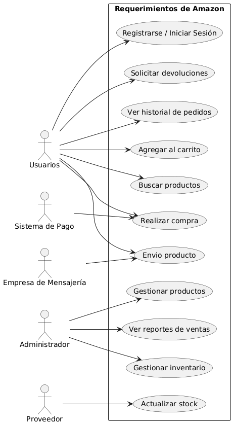

# Requerimientos de Amazon

## Requerimientos Funcionales

1. **Gestion de usuarios**
   - Registro de nuevos usuarios.
   - Login / Logout.
   - Edición de perfil de usuario.

2. **Gestion de productos**
   - Busqueda y filtrado de productos.
   - Clasificación de productos por categoria.
   - Gestión de inventario por los administradores.

3. **Carrito de compras**
   - Agregar productos al carrito.
   - Modificar cantidades.
   - Eliminar productos del carrito.

4. **Proceso de compra**
   - Selección de métodos de pago.
   - Validación de información de pago.
   - Confirmación de compra.
   - Generación de factura.

5. **Gestion de pedidos**
   - Seguimiento de pedidos en tiempo real.
   - Cancelación y devoluciones.
   - Historial de pedidos del usuario.

6. **Gestion de envios**
   - Selección de dirección de envio.
   - Gestionar la entraga de pedidos.

---

## Requerimientos No Funcionales

1. **Rendimiento**
   - El sistema debe soportar multiples usuarios concurrentes
   - El tiempo de respuesta de una busqueda debe ser en pocos segundos.

2. **Disponibilidad**
   - El sitio debe ser tolerante a fallos, es decir estar disponible el 99.9% del tiempo.
   - Respaldo automatico de la base de datos segun la necesidad.

3. **Seguridad**
   - Cifrado de contraseñas y datos sensibles.
   - Autenticación con tokens.
   - Protección contra ataques.

4. **Escalabilidad**
   - La arquitectura debe permitir crecimiento horizontal (más servidores).
   - Uso de balanceadores de carga.

5. **Usabilidad**
   - Interfaz intuitiva y accesible.
   - Compatible con dispositivos móviles (responsive).
   - Idiomas configurables (multilenguaje).

---

## Actores

- **Usuarios**: Usuario que compra productos.  
- **Administrador**: Persona encargada de gestionar productos e inventario.  
- **Proveedor**: Encargado de surtir productos.  
- **Sistema de pago**: Pasarela de pago externa  
- **Empresa de mensajería**: Servicio externo para gestionar envíos.  

---

## Diagrama de Casos de Uso

